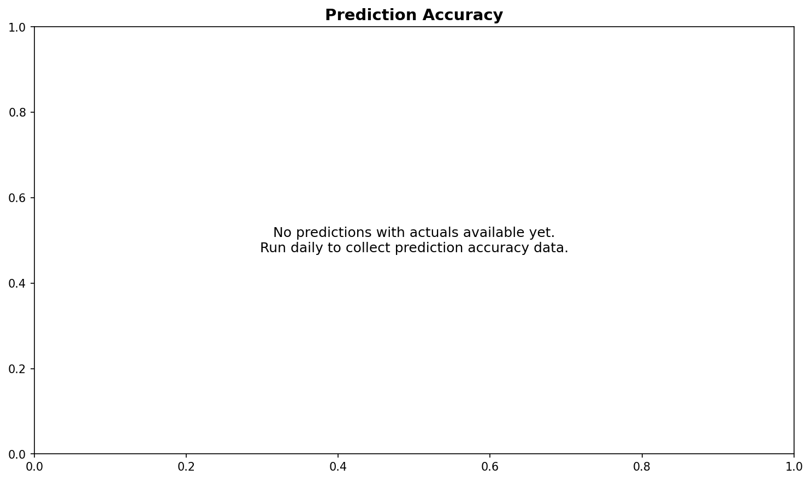

# Predicting Content Moderation Using News-Driven Keyword and Sentiment Signals

**ID2223 Project - December 2025**

Benedict Wolff and Kasper Malm

## Research Objective

Investigate whether news coverage, analyzed through sentiment extraction, can predict content moderation decisions reported in the DSA Transparency Database.

## Key Finding

**News sentiment has no predictive power on DSA content moderation.**

| Feature | Importance |
|---------|------------|
| weekofyear | 0.344 |
| lag_1 (yesterday's count) | 0.240 |
| month | 0.174 |
| month_effect | 0.137 |
| negative_news_rolling_7 | 0.001 |

Content moderation appears driven by internal platform processes and schedules, not reactive to external news cycles. Bad news days do not trigger increased takedowns.

## Data Sources

- **DSA Transparency Database** - Content moderation decisions by hosting services
  https://transparency.dsa.ec.europa.eu/
  
- **News API** - Daily news articles for sentiment analysis
  https://www.thenewsapi.com/

## Methodology

1. **Data Collection** - 365 days of DSA reports + news articles
2. **Sentiment Extraction** - VADER sentiment analysis on news headlines
3. **Feature Engineering** - Calendar features, lag features, rolling statistics, sentiment aggregations
4. **Model** - Gradient Boosting Regressor
5. **Evaluation** - RMSE, MAE, MAPE, R²

## Violation Categories Tracked

- Risk for public security
- Negative effects on civic discourse or elections
- Illegal or harmful speech

## Setup

1. Copy .env.example to .env:
   ```bash
   cp .env.example .env
   ```

2. Edit .env with your News API credentials:
   ```env
   NEWS_API_TOKEN=your_actual_api_token
   NEWS_API_PLAN=free
   ```
   
   Plans:
   - `free`: 3 articles/request, 100 requests/day
   - `basic`: 25 articles/request, 2500 requests/day

3. Install dependencies:
   ```bash
   pip install pandas numpy scikit-learn matplotlib vaderSentiment python-dotenv requests
   ```

## Scripts

| Script | Make Command | Purpose |
|--------|--------------|---------|
| backfill_data.py | `make backfill` | Fetch 365 days of DSA + news data |
| train_model.py | `make train` | Train gradient boosting model |
| daily_update.py | `make daily` | Fetch today's DSA + news |
| inference.py | `make infer` | Make predictions + track accuracy |
| generate_sample_data.py | - | Generate test data without API |

## Usage

```bash
make backfill    # Fetch 365 days of DSA + news data
make train       # Train gradient boosting model
make infer       # Make predictions + track accuracy
make daily       # Fetch today's DSA + news
make clean       # Remove csv, img, model folders
make all         # Run backfill, train, infer
```

Or run scripts directly:
```bash
python backfill_data.py
python train_model.py
python inference.py
```

Daily updates:
```bash
make daily && make infer
```

## Output Files

```
csv/
  dsa_violations.csv          # Raw DSA data by category
  news_history.csv            # News articles with sentiment
  dsa_news_combined.csv       # Daily aggregated features
  predictions_history.csv     # Predictions vs actuals

img/
  backfill_visualization.png  # DSA + sentiment overview
  training_results.png        # Model validation
  feature_importance.png      # Feature rankings
  forecast_next_week.png      # 7-day forecast
  prediction_accuracy.png     # Prediction tracking

model/
  dsa_model.pkl               # Trained model
  feature_cols.json           # Feature list
```

## Results

The model achieved poor validation performance (R² = -60.27) due to:

1. A regime change in DSA reporting around June 2025 (3.5M → 200K daily reports)
2. News sentiment features contributing <0.1% to predictions

This supports the conclusion that platform content moderation follows internal processes rather than external news events.

### Data Overview


### Feature Importance


### Model Training Results


### 7-Day Forecast


### Prediction Accuracy Tracking



## References

- DSA Transparency Database: https://transparency.dsa.ec.europa.eu/
- VADER Sentiment Analysis: https://github.com/cjhutto/vaderSentiment
- TheNewsAPI: https://www.thenewsapi.com/