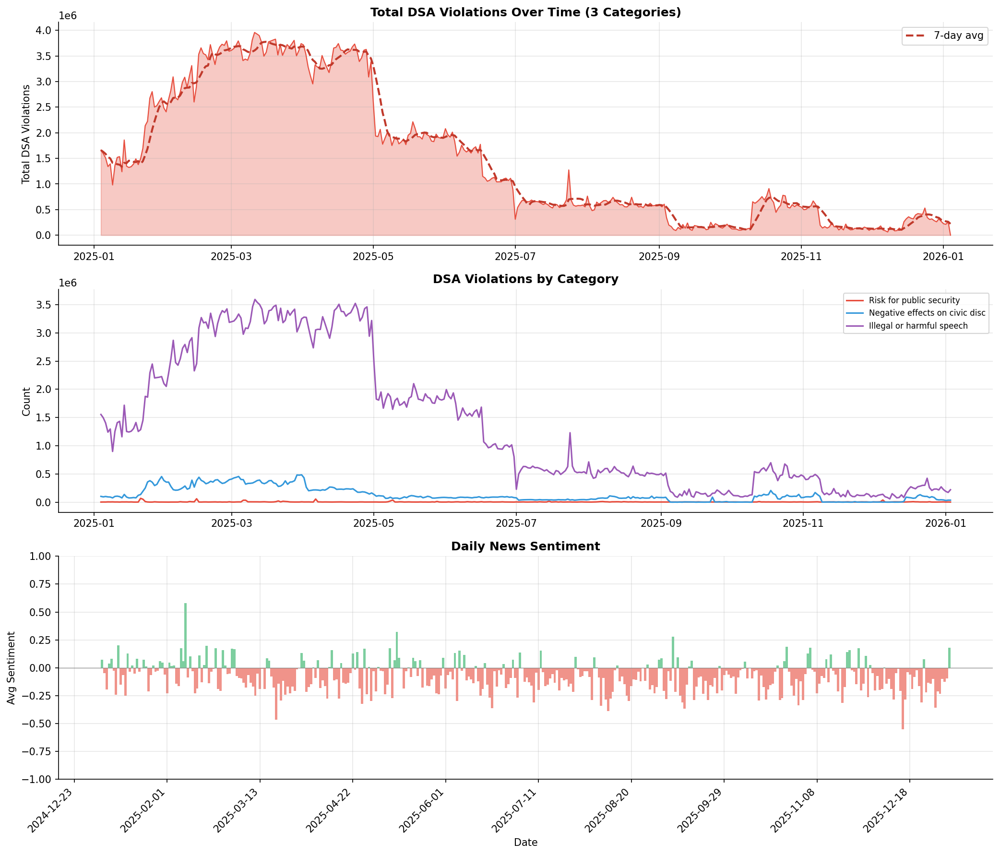
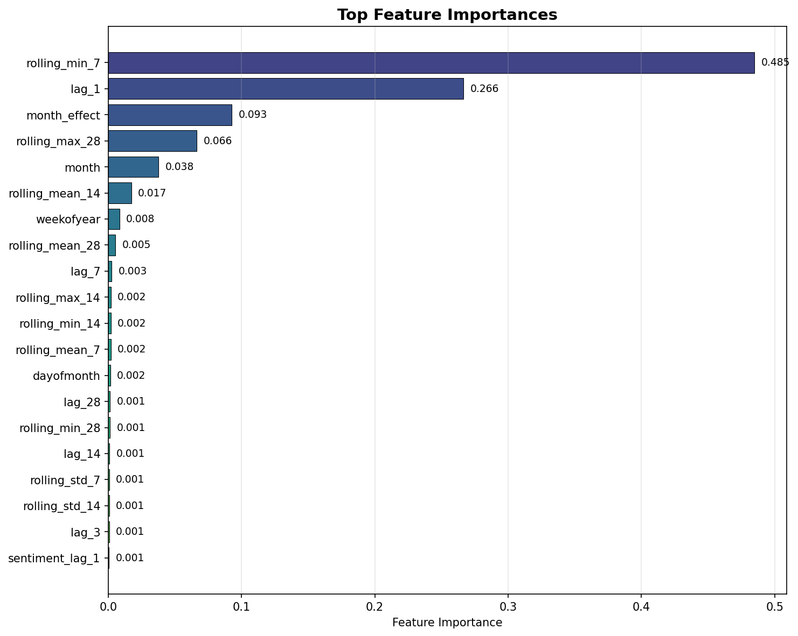
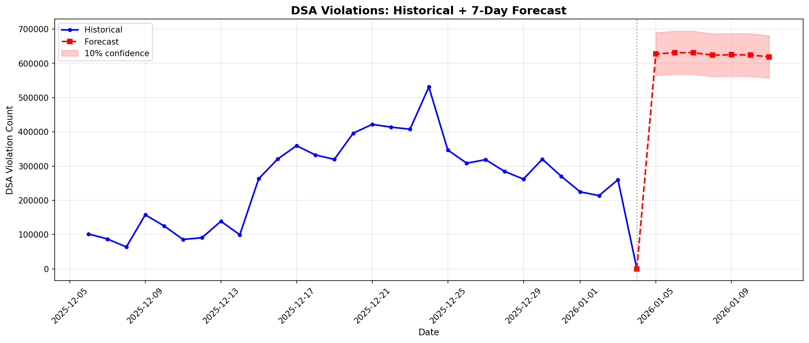

# Predicting Content Moderation Using News-Driven Keyword and Sentiment Signals

**ID2223 Project - December 2025**

Benedict Wolff and Kasper Malm

**Live Dashboard:** https://jgfegecmrc7zj3cuzcimz9.streamlit.app

## Research Objective

Investigate whether news coverage, analyzed through sentiment extraction, can predict content moderation decisions reported in the DSA Transparency Database.

## Key Finding

**News sentiment has no predictive power on DSA content moderation.**

| Feature | Importance |
|---------|------------|
| weekofyear | 0.344 |
| lag_1 (yesterday's count) | 0.240 |
| month | 0.174 |
| month_effect | 0.137 |
| negative_news_rolling_7 | 0.001 |

Content moderation appears driven by internal platform processes and schedules, not reactive to external news cycles. Bad news days do not trigger increased takedowns.

## Data Sources

- **DSA Transparency Database** - Content moderation decisions by hosting services
  https://transparency.dsa.ec.europa.eu/
  
- **News API** - Daily news articles for sentiment analysis
  https://www.thenewsapi.com/

## Methodology

1. **Data Collection** - 365 days of DSA reports + news articles
2. **Sentiment Extraction** - VADER sentiment analysis on news headlines
3. **Feature Engineering** - Calendar features, lag features, rolling statistics, sentiment aggregations
4. **Model** - Gradient Boosting Regressor
5. **Evaluation** - RMSE, MAE, MAPE, R²

## Violation Categories Tracked

- Risk for public security
- Negative effects on civic discourse or elections
- Illegal or harmful speech

## Setup

1. Copy .env.example to .env:
   ```bash
   cp .env.example .env
   ```

2. Edit .env with your News API credentials:
   ```env
   NEWS_API_TOKEN=your_actual_api_token
   NEWS_API_PLAN=free
   ```
   
   Plans:
   - `free`: 3 articles/request, 100 requests/day
   - `basic`: 25 articles/request, 2500 requests/day

3. Install dependencies:
   ```bash
   pip install pandas numpy scikit-learn matplotlib vaderSentiment python-dotenv requests
   ```

## Scripts

| Script | Make Command | Purpose |
|--------|--------------|---------|
| backfill.py | `make backfill` | Fetch 365 days of DSA + news data |
| train.py | `make train` | Train gradient boosting model |
| daily.py | `make daily` | Fetch today's DSA + news |
| inference.py | `make infer` | Make predictions + track accuracy |
| hindcast.py | `make hindcast` | Walk-forward backtesting validation |
| dashboard.py | `make dashboard` | Launch Streamlit dashboard |
| feature_pipeline.py | `make features` | Upload features to Hopsworks |
| training_pipeline.py | `make train-hw` | Train model using Hopsworks |
| inference_pipeline.py | `make infer-hw` | Run inference with Hopsworks |

## Usage

```bash
make backfill    # Fetch 365 days of DSA + news data
make train       # Train gradient boosting model
make infer       # Make predictions + track accuracy
make hindcast    # Run walk-forward backtesting
make daily       # Fetch today's DSA + news
make dashboard   # Launch Streamlit dashboard
make clean       # Remove csv, img, model folders
make all         # Run backfill, train, infer, hindcast
```

Hopsworks integration:
```bash
make features    # Upload features to Hopsworks Feature Store
make train-hw    # Train model using Hopsworks
make infer-hw    # Run inference with Hopsworks
```

Daily updates:
```bash
make daily && make infer
```

## Automated Daily Updates

A GitHub Actions workflow runs daily to:
1. Fetch new DSA violations and news data
2. Upload features to Hopsworks
3. Run inference and update predictions
4. Commit updated CSVs to the repository

To set up automation, add these secrets in **Settings → Secrets → Actions**:
- `NEWS_API_TOKEN` - Your News API token
- `HOPSWORKS_API_KEY` - Your Hopsworks API key
- `HOPSWORKS_PROJECT` - Your Hopsworks project name

You can also trigger the workflow manually from the **Actions** tab.

## Output Files

```
csv/
  dsa_violations.csv          # Raw DSA data by category
  news_history.csv            # News articles with sentiment
  dsa_news_combined.csv       # Daily aggregated features
  predictions_history.csv     # Predictions vs actuals
  hindcast_results.csv        # Walk-forward backtest predictions
  hindcast_metrics.csv        # Backtest accuracy by horizon

img/
  backfill_visualization.png  # DSA + sentiment overview
  training_results.png        # Model validation
  feature_importance.png      # Feature rankings
  forecast_next_week.png      # 7-day forecast
  prediction_accuracy.png     # Prediction tracking
  hindcast_results.png        # Backtest visualization

model/
  dsa_model.pkl               # Trained model
  feature_cols.json           # Feature list
```

## Results

### Hindcast (Backtesting) Performance

Walk-forward validation over 10 months (301 predictions):

| Metric | Value | Interpretation |
|--------|-------|----------------|
| R² | 0.91 | Good - model captures trend |
| MAPE | 63% | Bad - data has inherent volatility |
| Within 10% error | 40% | |
| Within 20% error | 57% | |

| Horizon | MAPE | R² |
|---------|------|----|
| Day 1 | 48.8% | 0.955 |
| Day 3 | 55.2% | 0.907 |
| Day 7 | 64.9% | 0.856 |

The high R² with high MAPE indicates the model captures the pattern/trend well, but DSA violations have significant inherent randomness (viral events, platform changes) that cannot be predicted from historical data alone.

### Key Finding

The high R² value indicates that the model works well. However, given the high (bad) MAPE value the underlying pattern is difficult to predict indicating that there are no obvious correlation between moderation of news and sentiment of the news.

### Data Overview



### Feature Importance



### Model Training Results


### 7-Day Forecast




## References

- DSA Transparency Database: https://transparency.dsa.ec.europa.eu/
- VADER Sentiment Analysis: https://github.com/cjhutto/vaderSentiment
- TheNewsAPI: https://www.thenewsapi.com/
